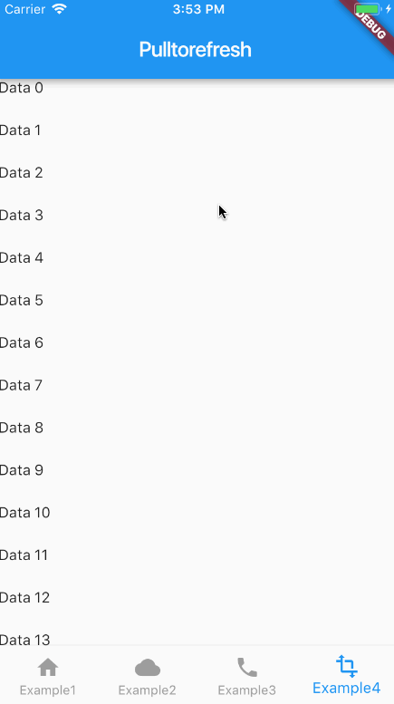
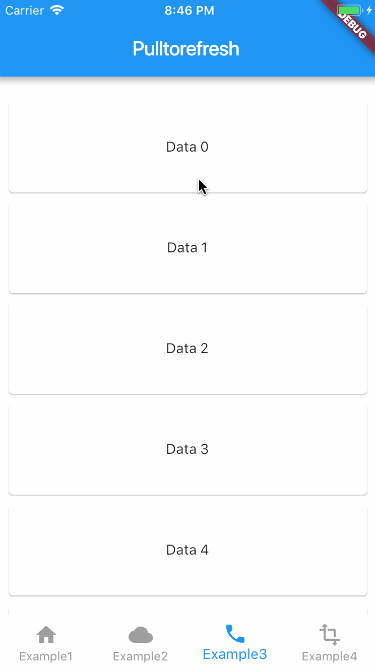

# Flutter_Pulltorefresh

## Intro
a widget provided to the flutter scroll component drop-down refresh and pull up load.support android and ios


## Features
* Android and iOS both spported
* pull up and pull down
* It's almost fit for all witgets,like GridView,ListView,Container,Text...
* High extensibility,High degree of freedom
* powerful Bouncing

## Screenshots



## How to use?
1.the first declare following in your pubspec.yml

```

   dependencies:
     pull_to_refresh: ^1.0.3
     
```

2.and then,import that line,SmartRefresher is a component that is wrapped outside your content View

```


   import "package:pull_to_refresh/pull_to_refresh.dart";
   ....
   
   build() =>
   
    new SmartRefresher(
        enablePullDownRefresh: true,
        enablePullUpLoad: true, 
        refreshMode: this.refreshing,
        loadMode: this.loading,
        onModeChange: _onModeChange,
        onOffsetChange: _onOffsetCallback,
        child: new Container(
          color: Colors.white,
          child: new ListView.builder(
            physics: const NeverScrollableScrollPhysics(),
            shrinkWrap: true,
            itemExtent: 40.0,
            itemCount: data.length,
            itemBuilder: (context,index){
              return data[index];
            },

          ),
        )
    )

```

3.You should set the indicator according to the different refresh mode.There are six refresh modes here:idel, startDrag, canRefresh, refreshing, complete,failed.build footer is the same with that.

```


  Widget _buildHeader(context,mode){
  
    return new Image.asset("images/animate.gif",height: 100.0,fit: BoxFit.cover,);
  }
  
 
  Widget _buildFooter(context,mode){
  
    ....
  }


```

4.
This refresh state requires you to update yourself in the logic code.
Refresh mode details please look at the following

```

  void _onModeChange(isUp,mode){
    if(isUp){
    	//when pull down refresh
      //must be do it
      setState(() {
        refreshing = mode;
      });
      	 // this is equals onRefresh() mostly
      if(mode==RefreshMode.refreshing) {
       //Simulating a network request to capture data
        new Future.delayed(const Duration(milliseconds: 2000), () {
          setState(() {
            /*
             when you catch data failed you can. set failed, 
             else completed
             */	
            refreshing = RefreshMode.failed;
          });
          print("Refreshed!!!");
        });
      }
    }
    else{
      //must be do it
      setState(() {
        loading= mode;
      });
      // this is equals onLoaadmore()
      if(mode==RefreshMode.refreshing) {

        new Future<Null>.delayed(const Duration(milliseconds: 2000), 	() {

          setState(() {
             data.add(new Text('Data '));

            loading = RefreshMode.completed;
          });
          print("LoadComplete!!!");
        });
      }
    }
  }
  
```

5.If your content view is a rolling component, such as ScrollView, ListView, GridView and so on, you assign these two attributes to the component.Because my parts are used in the ListView nested package,
this is very important,if you don't notice it,you will get some problems.

```
new ListView(){
    physics: const NeverScrollableScrollPhysics(),
    shrinkWrap: true,
    child:...
}

```


## Attention point
You should set the same indictor height for headerHeight and footerHeight.


```

/**

    the height is your headerContainer height
    Why do you want to set it this way?
    Look at the Exist problem.
*/


headerHeight:50.0,
footerHeight:50.0,


```

The component is unbounded, so when you use it, be careful about the problems caused by the height, especially the column, stack, which is also a control of unrestricted height, to be extra careful.


<a name = "point1"></a>

## Props Table

| Attribute Name     |     Attribute Explain     | Parameter Type | Default Value  | requirement |
|---------|--------------------------|:-----:|:-----:|:-----:|
| child      | your content View   | Widget   |   null |  necessary
| headerBuilder | the header indictor,if null it will be created by my default header     | (BuildContext,RefreshMode) => Widget  | null |optional |
| footerBuilder | the footer indictor,if null it will be created by my default footer     | (BuildContext,RefreshMode) => Widget  | null |optional |
| enablePullDownRefresh | switch of the pull down refresh     | boolean | true | optional |
| enablePullUpLoad |   switch of the pull up load | boolean | false |optional |
| refreshMode | It represents the state of the top indicator   | RefreshMode(enum) | RefreshMode.idel | if you enable pulldown,is necessary,else optional | 
| loadMode | It represents the state of the bottom indicator   | RefreshMode(enum) | RefreshMode.idel | if you enable pullup,is necessary,else optional | 
| completeDuration | It indicates the duration of display when the refresh is successful or failed.    | int | 800 | optional |
| headerHeight | must be equals with your header indictor height    | double | 50.0 | optional |
| footerHeight | must be equals with your footer indictor height    | double | 50.0 | optional |
| onModeChange | will callback when the refreshmode or loadmode is prepared to changed,it requires you to change the value yourself ,first paramter is if draging from top,second is the RefreshMode changed   | (bool,RefreshMode) => Void | null | optional |
| onOffsetChange | callback while you dragging(In addition to refreshing state and completing state)    | (double) => Void | null | optional |
| triggerDistance | This value represents the dragging distance to be reached in the trigger refreshing mode.  | double | 100.0 | optional |
| onOffsetChange | callback while you dragging(In addition to refreshing state and completing state)    | (double) => Void | null | optional |
| triggerDistance | This value represents the dragging distance to be reached in the trigger refreshing mode.  | double | 100.0 | optional |

## Existing problems

* I don't know how to calculate the height of the subcomponents
 ahead of time in the build method, for example: I want to get
 the height of the head indicator. I've been looking for a
  long time on the Google. I don't know how to solve this
  problem. If you have an idea, you can mention issue or pr.
 So I had better choose to pass in a value to the component,
 but increase the complexity.
 
* When the content View is less than the outside container, 
 I don't know how to hide it when the View is loaded, because there is no construction complete callback method that can let me hide, or how I should get the height of the content View before the construction method.
 
## LICENSE
 
 ```
 
MIT License

Copyright (c) 2018 Jpeng

Permission is hereby granted, free of charge, to any person obtaining a copy
of this software and associated documentation files (the "Software"), to deal
in the Software without restriction, including without limitation the rights
to use, copy, modify, merge, publish, distribute, sublicense, and/or sell
copies of the Software, and to permit persons to whom the Software is
furnished to do so, subject to the following conditions:

The above copyright notice and this permission notice shall be included in all
copies or substantial portions of the Software.

THE SOFTWARE IS PROVIDED "AS IS", WITHOUT WARRANTY OF ANY KIND, EXPRESS OR
IMPLIED, INCLUDING BUT NOT LIMITED TO THE WARRANTIES OF MERCHANTABILITY,
FITNESS FOR A PARTICULAR PURPOSE AND NONINFRINGEMENT. IN NO EVENT SHALL THE
AUTHORS OR COPYRIGHT HOLDERS BE LIABLE FOR ANY CLAIM, DAMAGES OR OTHER
LIABILITY, WHETHER IN AN ACTION OF CONTRACT, TORT OR OTHERWISE, ARISING FROM,
OUT OF OR IN CONNECTION WITH THE SOFTWARE OR THE USE OR OTHER DEALINGS IN THE
SOFTWARE.

 
 ```