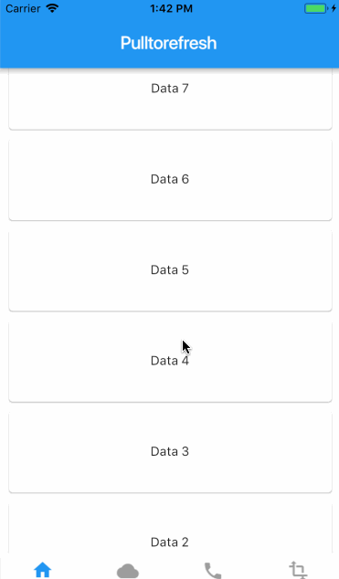

# flutter_pulltorefresh

## Intro
a widget provided to the flutter scroll component drop-down refresh and pull up load.support android and ios.
If you are Chinese,click here([中文文档](https://github.com/peng8350/flutter_pulltorefresh/blob/master/README_CN.md))


## Features
* Android and iOS both spported
* pull up and pull down
* It's almost fit for all witgets,like GridView,ListView,Container...
* High extensibility,High degree of freedom
* powerful Bouncing

## Screenshots

<br>
1.1.0(support reverse ScrollView)
<br>


## How to use?
1.the first declare following in your pubspec.yml

```

   dependencies:
     pull_to_refresh: ^1.1.4
     
```

2.and then,import that line,SmartRefresher is a component that is wrapped outside your content View

```


   import "package:pull_to_refresh/pull_to_refresh.dart";
   ....
   
   build() =>
   
    new SmartRefresher(
        enablePullDown: true,
        enablePullUp: true,
        onRefresh: _onRefresh,
        onOffsetChange: _onOffsetCallback,
        child: new ListView.builder(
                           physics: const NeverScrollableScrollPhysics(),
                           shrinkWrap: true,
                           itemExtent: 40.0,
                           itemCount: data.length,
                           itemBuilder: (context,index){
                             return data[index];
                           },

                         )
    )

```

3.You should set the indicator according to the different refresh mode.build footer is the same with that.
Of course, I have built an indicator convenient to use, called ClassicIndicator. If I do not meet the requirements, I can choose to define an indicator myself.

```


  Widget _buildHeader(context,mode){
   return new ClassicIndicator(mode: mode);
  }
  
 
  Widget _buildFooter(context,mode){
    // the same with header
    ....
  }

  new SmartRefresher(
     ....
     footerBuilder: _buildFooter,
     headerBuilder: _buildHeader
  )


```

4.
Whether at the top or bottom, the onRefresh will be callback when the indicator state is refreshed.
But how can I tell the result to SmartRefresher? It's very simple. It provides a RefreshController inside, you can pass the construction of a controller to SmartRefresher, and then call.SendBack (int status) can change the state of success or failure.

```

    void _onRefresh(bool up){
		if(up){
		   //headerIndicator callback
		   new Future.delayed(const Duration(milliseconds: 2009))
                               .then((val) {
                                 _refreshController.sendBack(true, RefreshStatus.failed);
                           });
		   
		}
		else{
			//footerIndicator Callback
		}
    }

  
```


## Props Table

SmartRefresher:

| Attribute Name     |     Attribute Explain     | Parameter Type | Default Value  | requirement |
|---------|--------------------------|:-----:|:-----:|:-----:|
| child      | your content View   | ? extends ScrollView   |   null |  necessary
| headerBuilder | the header indictor     | (BuildContext,int) => Widget  | null |if enablePullDown is necessary,else option |
| footerBuilder | the footer indictor     | (BuildContext,int) => Widget  | null |if enablePullUp is necessary,else option |
| enablePullDown | switch of the pull down      | boolean | true | optional |
| enablePullUp |   switch of the pull up  | boolean | false |optional |
| onRefresh | will callback when the one indicator is getting refreshing   | (bool) => Void | null | optional |
| onOffsetChange | callback while you dragging and outOfrange  | (bool,double) => Void | null | optional |
| controller | controll inner some states  | RefreshController | null | optional |
| headerConfig |  This setting will affect which type of indicator you use and config contains a lot props,such as triigerDistance,completedurtion...   | Config | RefreshConfig | optional |
| footerConfig |  This setting will affect which type of indicator you use and config contains a lot props,such as triigerDistance,completedurtion...    | Config | LoadConfig | optional |
| enableOverScroll |  the switch of Overscroll,When you use  RefreshIndicator(Material), you may have to shut down.    | bool | true | optional |

RefreshConfig:

| Attribute Name     |     Attribute Explain     |  Default Value  |
|---------|--------------------------|:-----:|
| triggerDistance      | Drag distance to trigger refresh   |   100.0 |
| completeDuration | Stay in time when you return to success and failure     |  800 |
| visibleRange | The scope of the indicator can be seen(refresh state)    |  50.0 |

LoadConfig:

| Attribute Name     |     Attribute Explain     |  Default Value  |
|---------|--------------------------|:-----:|
| triggerDistance      | Drag distance to trigger loading   |   5.0 |
| autoLoad | enable open Auto Load,If false triggerDistance is invalid    |  true |
| bottomWhenBuild | Is it at the bottom of listView when it is loaded(When your header is LoadConfig)    |  true |

## FAQ
<h3>1.Does it support simple RefreshIndicator (material) + pull up loading and no elastic refresh combination?<br></h3>
Yes, as long as you set the node properties enableOverScroll = false, enablePullDown = false, it's OK to wrap a single RefreshIndicator outside, and example4 has given an example in demo.

<h3>2.Does it support an indicator that does not follow the list?<br></h3>
This I did not package in the library, because even if I encapsulated,
it would only make the logic complexity of the code increased,
so you need yourself to use the onOffsetChange callback method to implement it.
It is not difficult to use Stack to encapsulate it. It can refer to the idea of
 Example3 or my project flutter_gank.

<h3>3.Why does child attribute extend from original widget to scrollView?<br></h3>
Because of my negligence, I didn't take into account the problem that child needed to cache the item,
so the 1.1.3 version had corrected the problem of not caching.

<h3>4.What impact does this library have on performance?<br></h3>
No, although I did not actually use data to test performance problems,
I did not appear to pull up or pull down the sliding carton situation in
the process of another project development.

<h3>5.Is there any way to achieve the maximum distance to limit springback?<br></h3>
The answer is negative. I know that it must be done by modifying the ScrollPhysics,
but I am not quite sure about the Api in it, but I failed.
If you have a way to solve this problem, please come to a PR


## LICENSE
 
```
 
MIT License

Copyright (c) 2018 Jpeng

Permission is hereby granted, free of charge, to any person obtaining a copy
of this software and associated documentation files (the "Software"), to deal
in the Software without restriction, including without limitation the rights
to use, copy, modify, merge, publish, distribute, sublicense, and/or sell
copies of the Software, and to permit persons to whom the Software is
furnished to do so, subject to the following conditions:

The above copyright notice and this permission notice shall be included in all
copies or substantial portions of the Software.

THE SOFTWARE IS PROVIDED "AS IS", WITHOUT WARRANTY OF ANY KIND, EXPRESS OR
IMPLIED, INCLUDING BUT NOT LIMITED TO THE WARRANTIES OF MERCHANTABILITY,
FITNESS FOR A PARTICULAR PURPOSE AND NONINFRINGEMENT. IN NO EVENT SHALL THE
AUTHORS OR COPYRIGHT HOLDERS BE LIABLE FOR ANY CLAIM, DAMAGES OR OTHER
LIABILITY, WHETHER IN AN ACTION OF CONTRACT, TORT OR OTHERWISE, ARISING FROM,
OUT OF OR IN CONNECTION WITH THE SOFTWARE OR THE USE OR OTHER DEALINGS IN THE
SOFTWARE.

 
 ```