# flutter_pulltorefresh
<a href="https://pub.dev/packages/pull_to_refresh">
  
</a>
<a href="https://flutter.dev/">
  
</a>
<a href="https://opensource.org/licenses/MIT">
  
</a>

## Intro
a widget provided to the flutter scroll component drop-down refresh and pull up load.support android and ios.
If you are Chinese,click here([中文文档](https://github.com/peng8350/flutter_pulltorefresh/blob/master/README_CN.md))


## Features
* pull up load and pull down refresh
* It's almost fit for all Scroll witgets,like GridView,ListView...
* provide global setting of default indicator and property
* provide some most common indicators
* Support Android and iOS default ScrollPhysics,the overScroll distance can be controlled,custom spring animate,damping,speed.
* horizontal and vertical refresh,support reverse ScrollView also(four direction)
* provide more refreshStyle: Behind,Follow,UnFollow,Front,provide more loadmore style
* Support twoLevel refresh,implments just like TaoBao twoLevel,Wechat TwoLevel
* enable link indicator which placing other place,just like Wechat FriendCircle refresh effect

## Usage

add this line to pubspec.yaml

```yaml

   dependencies:

    pull_to_refresh: ^2.0.0


```

import package

```dart

    import 'package:pull_to_refresh/pull_to_refresh.dart';

```

simple example,***It must be noted here that ListView must be the child of SmartRefresher and cannot be separated from it. For detailed reasons, see <a href="child">here</a>***

```dart


  List<String> items = ["1", "2", "3", "4", "5", "6", "7", "8"];
  RefreshController _refreshController =
      RefreshController(initialRefresh: false);

  void _onRefresh() async{
    // monitor network fetch
    await Future.delayed(Duration(milliseconds: 1000));
    // if failed,use refreshFailed()
    _refreshController.refreshCompleted();
  }

  void _onLoading() async{
    // monitor network fetch
    await Future.delayed(Duration(milliseconds: 1000));
    // if failed,use loadFailed(),if no data return,use LoadNodata()
    items.add((items.length+1).toString());
    if(mounted)
    setState(() {

    });
    _refreshController.loadComplete();
  }

  @override
  Widget build(BuildContext context) {
    return Scaffold(
      body: SmartRefresher(
        enablePullDown: true,
        enablePullUp: true,
        header: WaterDropHeader(),
        footer: CustomFooter(
          builder: (BuildContext context,LoadStatus mode){
            Widget body ;
            if(mode==LoadStatus.idle){
              body =  Text("pull up load");
            }
            else if(mode==LoadStatus.loading){
              body =  CupertinoActivityIndicator();
            }
            else if(mode == LoadStatus.failed){
              body = Text("Load Failed!Click retry!");
            }
            else if(mode == LoadStatus.canLoading){
                body = Text("release to load more");
            }
            else{
              body = Text("No more Data");
            }
            return Container(
              height: 55.0,
              child: Center(child:body),
            );
          },
        ),
        controller: _refreshController,
        onRefresh: _onRefresh,
        onLoading: _onLoading,
        child: ListView.builder(
          itemBuilder: (c, i) => Card(child: Center(child: Text(items[i]))),
          itemExtent: 100.0,
          itemCount: items.length,
        ),
      ),
    );
  }

  // from 1.5.0, it is not necessary to add this line
  //@override
 // void dispose() {
    // TODO: implement dispose
  //  _refreshController.dispose();
  //  super.dispose();
 // }

```

The global configuration RefreshConfiguration, which configures all Smart Refresher representations under the subtree, is generally stored at the root of MaterialApp and is similar in usage to ScrollConfiguration.
In addition, if one of your SmartRefresher behaves differently from the rest of the world, you can use RefreshConfiguration.copyAncestor() to copy attributes from your ancestor RefreshConfiguration and replace
attributes that are not empty.

```dart
    // Smart Refresher under the global configuration subtree, here are a few particularly important attributes
     RefreshConfiguration(
         headerBuilder: () => WaterDropHeader(),        // Configure the default header indicator. If you have the same header indicator for each page, you need to set this
         footerBuilder:  () => ClassicFooter(),        // Configure default bottom indicator
         headerTriggerDistance: 80.0,        // header trigger refresh trigger distance
         springDescription:SpringDescription(stiffness: 170, damping: 16, mass: 1.9),         // custom spring back animate,the props meaning see the flutter api
         maxOverScrollExtent :100, //The maximum dragging range of the head. Set this property if a rush out of the view area occurs
         maxUnderScrollExtent:0, // Maximum dragging range at the bottom
         enableScrollWhenRefreshCompleted: true, //This property is incompatible with PageView and TabBarView. If you need TabBarView to slide left and right, you need to set it to true.
         enableLoadingWhenFailed : true, //In the case of load failure, users can still trigger more loads by gesture pull-up.
         hideFooterWhenNotFull: false, // Disable pull-up to load more functionality when Viewport is less than one screen
         enableBallisticLoad: true, // trigger load more by BallisticScrollActivity
        child: MaterialApp(
            ........
        )
    );

```

1.5.6 add new feather: localization ,you can add following code in MaterialApp or CupertinoApp:

```dart

    MaterialApp(
            localizationsDelegates: [
              // this line is important
              RefreshLocalizations.delegate,
              GlobalWidgetsLocalizations.delegate,
              GlobalMaterialLocalizations.delegate
            ],
            supportedLocales: [
              const Locale('en'),
              const Locale('zh'),
            ],
            localeResolutionCallback:
                (Locale locale, Iterable<Locale> supportedLocales) {
              //print("change language");
              return locale;
            },
    )

```


## ScreenShots


### Examples
|Style| [basic](example/lib/ui/example/useStage/basic.dart) | [header in other place](example/lib/ui/example/customindicator/link_header_example.dart) | [reverse + horizontal](example/lib/ui/example/useStage/horizontal+reverse.dart) |
|:---:|:---:|:---:|:---:|
|| 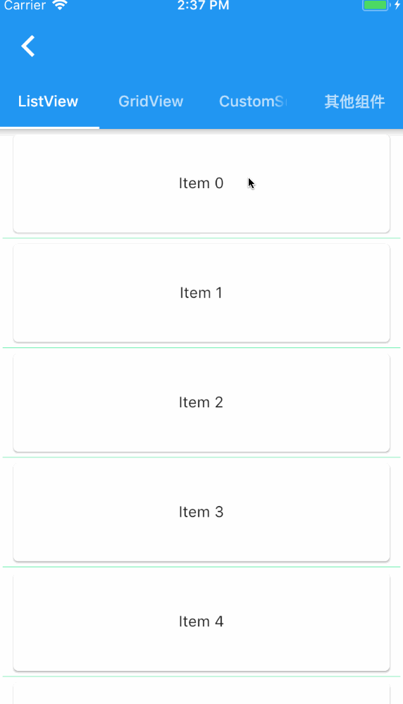 | 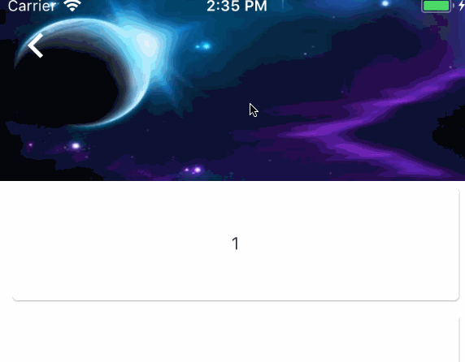 |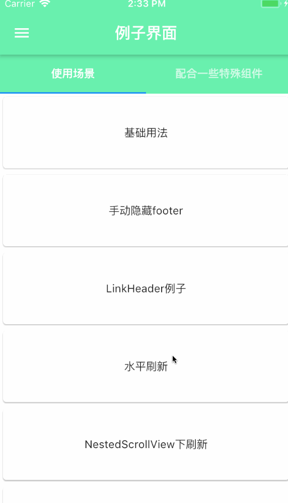 |

|Style|  [twoLevel](example/lib/ui/example/useStage/twolevel_refresh.dart) |[use with other widgets](example/lib/ui/example/otherwidget) |  [chat](example/lib/ui/example/useStage/qq_chat_list.dart) |
|:---:|:---:|:---:|:---:|
||  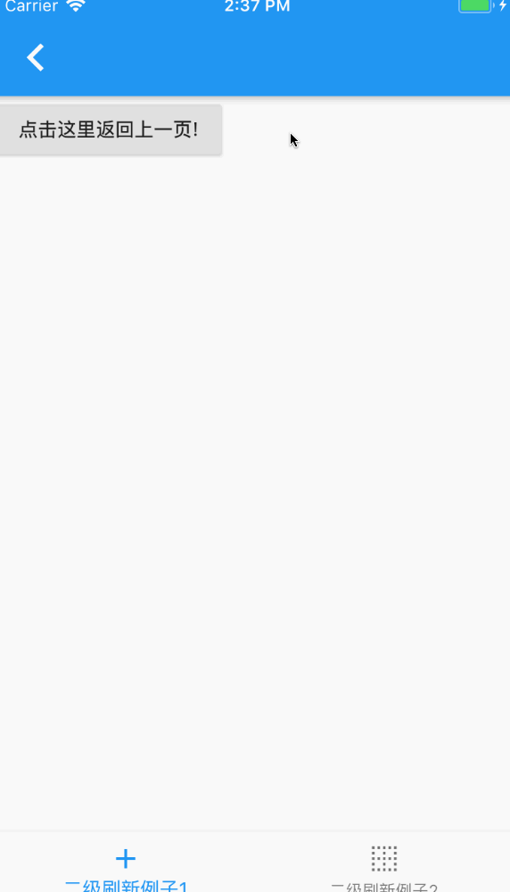 |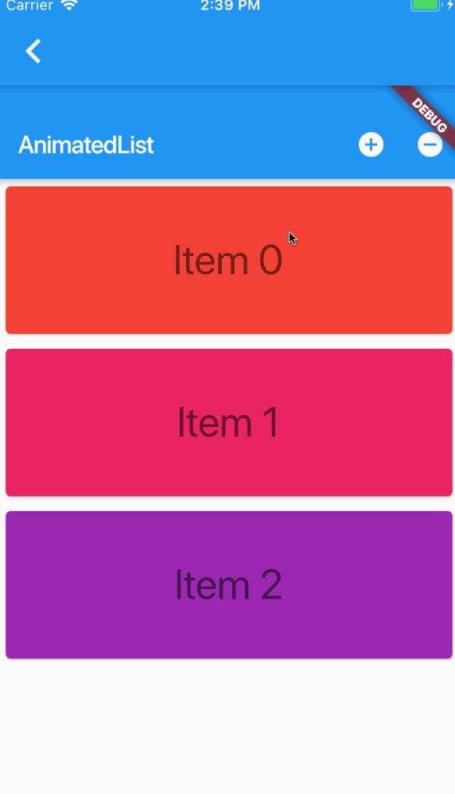 | 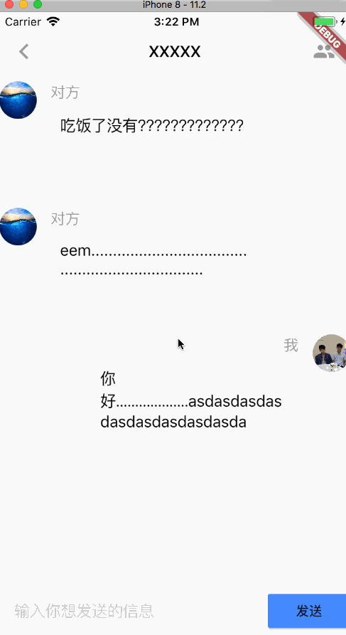 |


|Style| [simple custom header(使用SpinKit)](example/lib/ui/example/customindicator/spinkit_header.dart)| [dragableScrollSheet+LoadMore](example/lib/ui/example/otherwidget/draggable_bottomsheet_loadmore.dart)|[Gif Indicator](example/lib/ui/example/customindicator/gif_indicator_example1.dart) |
|:---:|:---:|:---:|:---:|
|| 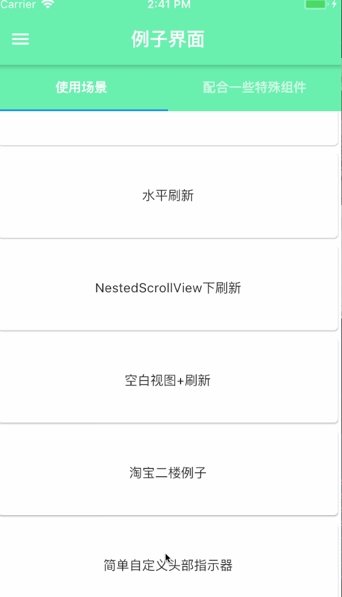 | 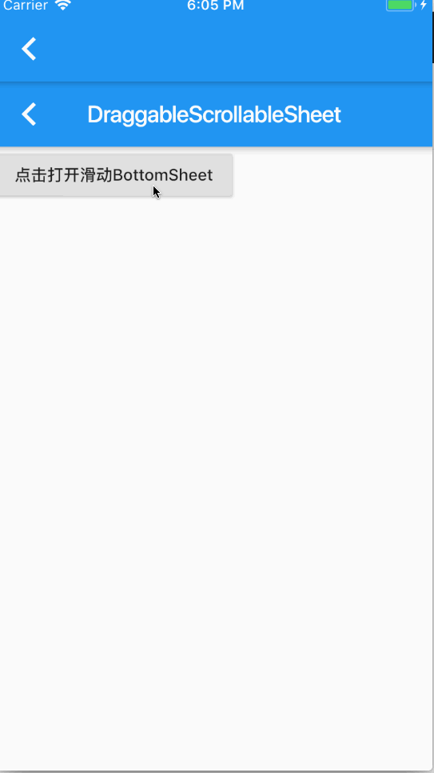 | 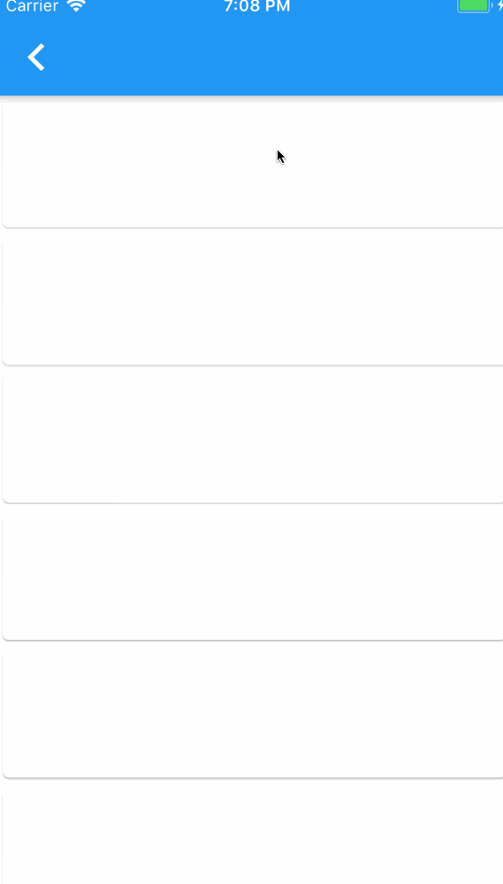 |


### Indicator

### 各种指示器

| refresh style |   |pull up load style| |
|:---:|:---:|:---:|:---:|
| RefreshStyle.Follow <br>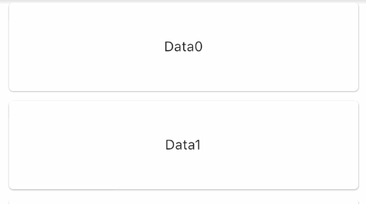|RefreshStyle.UnFollow <br> | LoadStyle.ShowAlways <br>  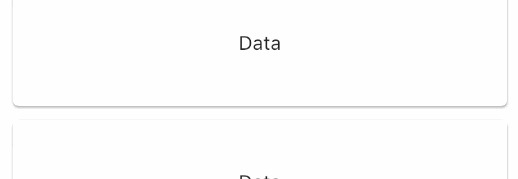 | LoadStyle.HideAlways<br> 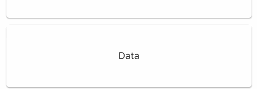|
| RefreshStyle.Behind <br> | RefreshStyle.Front <br> | LoadStyle.ShowWhenLoading<br>   | |

|Style| [ClassicIndicator](https://github.com/peng8350/flutter_pulltorefresh/blob/master/lib/src/indicator/classic_indicator.dart) | [WaterDropHeader](https://github.com/peng8350/flutter_pulltorefresh/blob/master/lib/src/indicator/waterdrop_header.dart) | [MaterialClassicHeader](https://github.com/peng8350/flutter_pulltorefresh/blob/master/lib/src/indicator/material_indicator.dart) |
|:---:|:---:|:---:|:---:|
|| 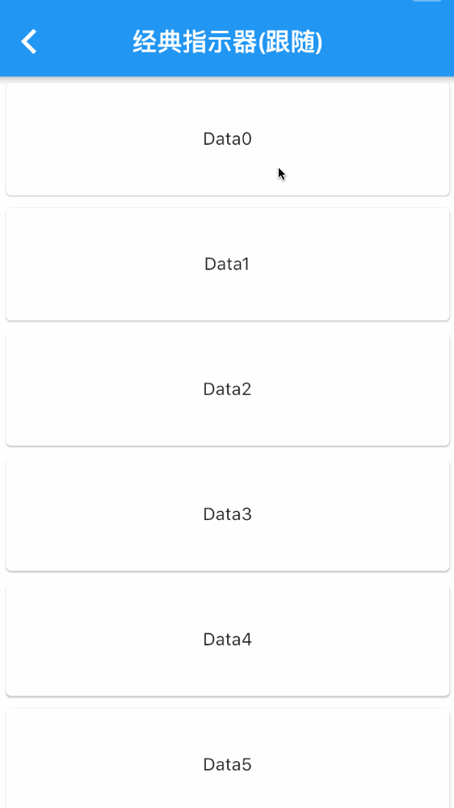 | 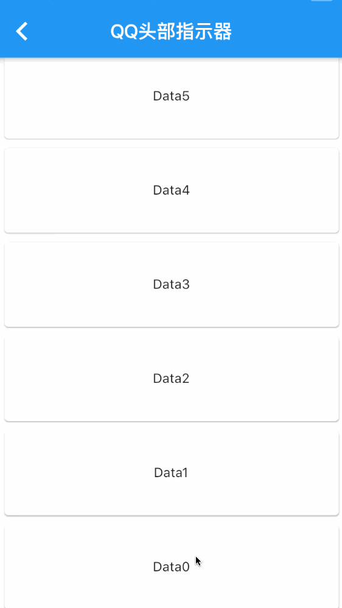 | 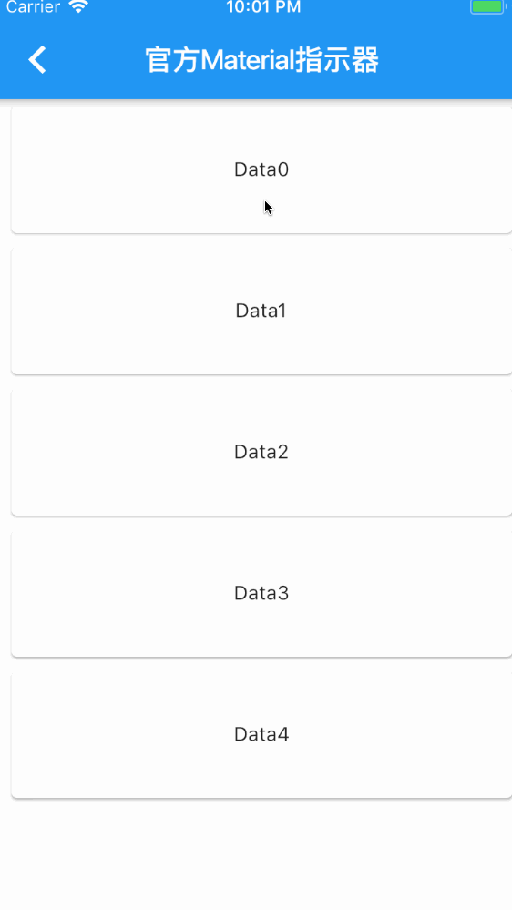 |

|Style|  [WaterDropMaterialHeader](https://github.com/peng8350/flutter_pulltorefresh/blob/master/lib/src/indicator/material_indicator.dart) | [Shimmer Indicator](example/lib/ui/example/customindicator/shimmer_indicator.dart) |[Bezier+Circle](https://github.com/peng8350/flutter_pulltorefresh/blob/master/lib/src/indicator/bezier_indicator.dart) |
|:---:|:---:|:---:|:---:|
||  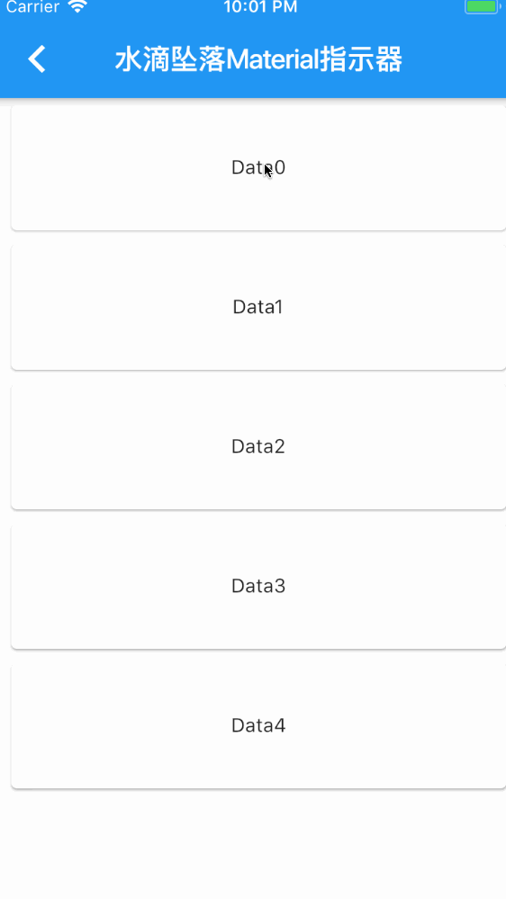 |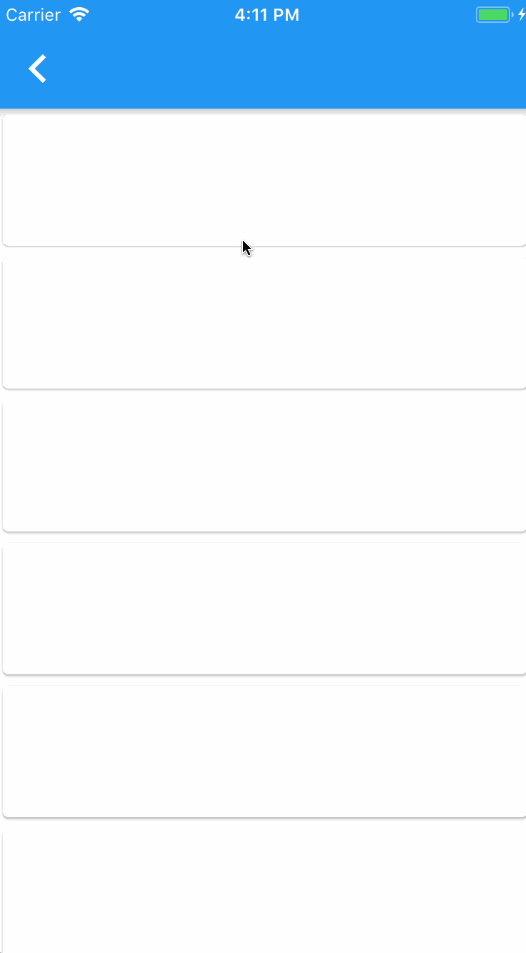 | 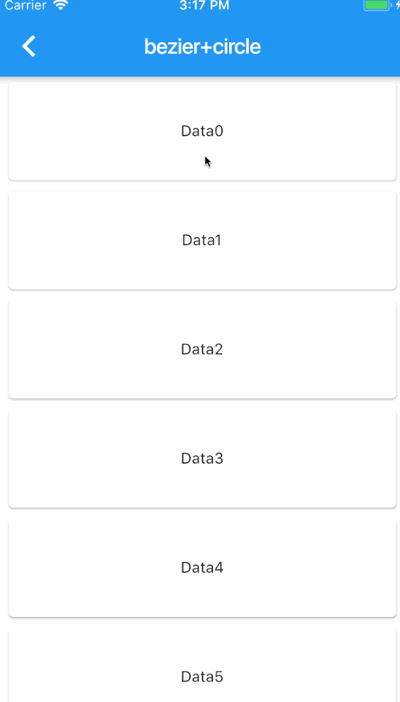 |


<a name="child"></a>

## about SmartRefresher's child explain

Since 1.4.3, the child attribute has changed from ScrollView to Widget, but this does not mean that all widgets are processed the same. SmartRefresher's internal implementation mechanism is not like  NestedScrollView<br><br>
There are two main types of processing mechanisms here, `the first category`is the component inherited from ScrollView. At present, there are only three types,
 `ListView`, `GridView`, `CustomScrollView`. ` The second category ` is components that are not inherited from ScrollView, which generally put empty views,
  NoScrollable views (NoScrollable convert Scrollable), PageView, and you don't need to estimate height  by `LayoutBuilder` yourself.
<br><br>
For the first type of mechanism, slivers are taken out of the system "illegally". The second is to put children directly into classes such as `SliverToBox Adapter'. By splicing headers and footers back and forth to form slivers, and then putting slivers inside Smart Refresher into CustomScrollView, you can understand Smart Refresher as CustomScrollView,
because the inside is to return to CustomScrollView. So, there's a big difference between a child node and a ScrollView.
<br><br>
Now, guess you have a requirement: you need to add background, scrollbars or something outside ScrollView. Here's a demonstration of errors and correct practices

```dart

   //error
   SmartRefresher(
      child: ScrollBar(
          child: ListView(
             ....
      )
    )
   )

   // right
   ScrollBar(
      child: SmartRefresher(
          child: ListView(
             ....
      )
    )
   )

```

Demonstrate another wrong doing,put ScrollView in another widget

```dart

   //error
   SmartRefresher(
      child:MainView()
   )

   class MainView extends StatelessWidget{
       Widget build(){
          return ListView(
             ....
          );
       }

   }

```

The above mistake led to scrollable nesting another scrollable, causing you to not see the header and footer no matter how slippery you are.
Similarly, you may need to work with components like NotificationListener, ScrollConfiguration..., remember, don't store them outside ScrollView (you want to add refresh parts) and Smart Refresher memory.。


## More
- [Property Document](propertys_en.md) or [Api/Doc](https://pub.dev/documentation/pull_to_refresh/latest/pulltorefresh/SmartRefresher-class.html)
- [Custom Indicator](custom_indicator_en.md)
- [Inner Attribute Of Indicators](indicator_attribute_en.md)
- [Update Log](CHANGELOG.md)
- [Notice](notice_en.md)
- [FAQ](problems_en.md)


## Exist Problems
* about NestedScrollView,When you slide down and then slide up quickly, it will return back. The main reason is that
 NestedScrollView does not consider the problem of cross-border elasticity under
 bouncingScrollPhysics. Relevant flutter issues: 34316, 33367, 29264. This problem
 can only wait for flutter to fix this.
* SmartRefresher does not have refresh injection into ScrollView under the subtree, that is, if you put AnimatedList or RecordableListView in the child
 is impossible. I have tried many ways to solve this problem and failed. Because of the
 principle of implementation, I have to append it to the head and tail of slivers. In fact, the problem is not that much of my
Component issues, such as AnimatedList, can't be used with AnimatedList and GridView unless
 I convert AnimatedList to SliverAnimatedList is the solution. At the moment,
 I have a temporary solution to this problem, but it's a bit cumbersome to rewrite the code inside it and then outside ScrollView.
Add SmartRefresher, see my two examples [Example 1](example/lib/other/refresh_animatedlist.dart)和[Example 2](example/lib/other/refresh_recordable_listview.dart)

## Thanks

[SmartRefreshLayout](https://github.com/scwang90/SmartRefreshLayout)

## LICENSE


```

MIT License

Copyright (c) 2018 Jpeng

Permission is hereby granted, free of charge, to any person obtaining a copy
of this software and associated documentation files (the "Software"), to deal
in the Software without restriction, including without limitation the rights
to use, copy, modify, merge, publish, distribute, sublicense, and/or sell
copies of the Software, and to permit persons to whom the Software is
furnished to do so, subject to the following conditions:

The above copyright notice and this permission notice shall be included in all
copies or substantial portions of the Software.

THE SOFTWARE IS PROVIDED "AS IS", WITHOUT WARRANTY OF ANY KIND, EXPRESS OR
IMPLIED, INCLUDING BUT NOT LIMITED TO THE WARRANTIES OF MERCHANTABILITY,
FITNESS FOR A PARTICULAR PURPOSE AND NONINFRINGEMENT. IN NO EVENT SHALL THE
AUTHORS OR COPYRIGHT HOLDERS BE LIABLE FOR ANY CLAIM, DAMAGES OR OTHER
LIABILITY, WHETHER IN AN ACTION OF CONTRACT, TORT OR OTHERWISE, ARISING FROM,
OUT OF OR IN CONNECTION WITH THE SOFTWARE OR THE USE OR OTHER DEALINGS IN THE
SOFTWARE.


 ```
