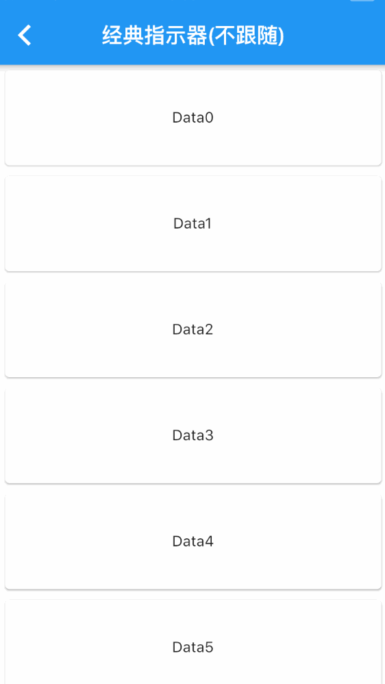
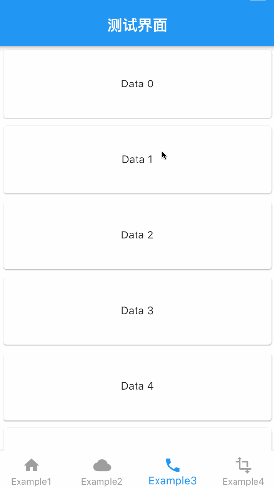

# flutter_pulltorefresh

## 介绍
一个提供上拉加载和下拉刷新的组件,同时支持Android和Ios

## 特性
* 提供上拉加载和下拉刷新
* 几乎适合所有部件
* 高度扩展性和很低的限制性
* 支持反转列表
* 提供多种刷新指示器风格:跟随,不跟随,位于背部,位于前部

## 指示器截图
### 四种指示器风格
|Style| 跟随经典指示器|不跟随经典指示器|
|:---:|:---:|:---:|
|art|  |  |

|Style|背部指示器|前面悬浮指示器|
|:---:|:---:|:---:|
|art|  |  |

### 各种指示器

|Style| 经典指示器(跟随,不跟随) | QQ水滴脱落 |
|:---:|:---:|:---:|
|art|  |  |

|Style| flutter提供的指示器| 水滴脱落(前面悬浮) |
|:---:|:---:|:---:|
|art|  |  |

## 我该怎么用?


```

   dependencies:
     pull_to_refresh: ^1.3.9

```

第一种使用方法,使用SmartRefresh和RefreshController(建议)
```

RefreshController _refreshController;

initState(){

    super.initState();
    // initialRefresh可以在组件初始化时执行一次刷新操作
    _refreshController = RefreshController(initialRefresh:true);
    // 如果你需要开始就请求一次刷新,1.3.9版本之前要这么做
    /*

        SchedulerBinding.instance.addPostFrameCallback((_) {
            _refreshController.requestRefresh();
           });

     */
}

void _onRefresh(){

   /*.  after the data return,
        use _refreshController.refreshComplete() or refreshFailed() to end refreshing
   */
}

void _onLoading(){
   /*
        use _refreshController.loadComplete() or loadNoData() to end loading
   */
}

build(){
...
SmartRefresher(
      enablePullDown: true,
      enablePullUp: true,
      header: defaultTargetPlatform == TargetPlatform.iOS?WaterDropHeader():WaterDropMaterialHeader(),
      controller: _refreshController,
      onRefresh: _onRefresh,
      onLoading: _onLoading,
      child: "yourContentScrollView",
    )
....
}

// don't forget to dispose refreshController
void dispose(){
    _refreshController.dispose();
    super.dispose();
}

```

第二种使用方法(1.3.7新增),考虑到有的时候Sliver不一定要放在头部

```

     /*
             1.请求刷新操作
             对于header为FrontStyle来说,animateTo(0.0),对于其他刷新风格来说,应animateTo(-triggerDistance),这个触发距离大部分默认为80,
             当然不是所有指示器的触发距离都是80,比如WaterDropHeader,它内部触发距离为100.0
            _animateTo(-80.0);

            2.请求加载更多的操作。
            _scrollController
                         .animateTo(scrollController.position.maxScrollExtent);

            3.有时,假如不得不操作内部指示器的状态,可以使用GlobalKey,内部已经暴露好getter和setter
            GlobalKey<LoadIndicatorState> key = GlobalKey();
            key.currentState.mode = LoadStatus.idle;
      */

    /*
     for physics:
     1.header为Follow,UnFollow,Behind风格
     返回RefreshBouncePhysics()即可
     2.header为Front
     当显示时需要返回RefreshClampPhysics(springBackDistance: 100.0),100.0对应header的高度
     当隐藏时返回ClampingScrollPhysics即可
    */
    CustomScrollView(
      controller: _scrollController,
      physics: RefreshBouncePhysics(), //don't forget,necessary
      slivers: [
        ....,
        _enablePullDown?ClassicHeader.asSliver(onRefresh: () async {
          await Future.delayed(Duration(milliseconds: 1000));
          // return true,it mean refreshCompleted,return false it mean refreshFailed
          return true;
        }):null,
        ....,
        _enablePullUp?ClassicFooter.asSliver(onLoading: () async {
          await Future.delayed(Duration(milliseconds: 1000));
          //return true it mean set the footerStatus to idle,else set to NoData state
          return true;
        }):null
      ].where((child) => child!=null).toList(),
    );

```


## 更多
- [SmartRefresher,RefreshController](refresher_controller.md)
- [自定义指示器](custom_indicator.md)
- [指示器内部属性介绍](indicator_attribute.md)
- [更新日志](CHANGELOG.md)
- [注意地方](notice.md)

## F.A.Q
* <h3>IOS状态栏双击为什么ListView不自动滚动到顶部?</h3>
这个问题经测试不是我封装的失误,当ListView里的controller被替换后,这个问题就会出现,原因大概是Scaffold里的处理操作,请issue flutter。

* <h3>如何兼容NestedScrollView?</h3>
1.3.0提供了一个新属性isNestWrapped来兼容这东西,注意,这个属性打开后,scollController取决于NestScrollView,内部通过PrimaryScrollController.of(context)
来获取scrollController,所以scrollController要放在NestedScrollView里。

* <h3>为什么使用CuperNavigationBar后(不只这一个情况),顶部或者尾部指示器有空白的地方?Or why is top of listView blocked?</h3>
很大可能是因为SafeArea,。解决方法一般是在SmartRefresher外围套用SafeArea

* <h3>兼容性方面?</h3>
自1.3.0换了一套新的方法去实现指示器，内部指示器实现是通过监听scrollController位置变化来实现的，并没有使用到类如NotificationListener和GestureDector这类可能引起滑动手势冲突的方法，
所以应该可以兼容大多需要利用到手势之间的库。但是，可能不兼容一些库需要改写ScrollPhysics，内部的FrontStyle就很明显需要用到这个。

## 感谢

[SmartRefreshLayout](https://github.com/scwang90/SmartRefreshLayout)


## 开源协议

```

MIT License

Copyright (c) 2018 Jpeng

Permission is hereby granted, free of charge, to any person obtaining a copy
of this software and associated documentation files (the "Software"), to deal
in the Software without restriction, including without limitation the rights
to use, copy, modify, merge, publish, distribute, sublicense, and/or sell
copies of the Software, and to permit persons to whom the Software is
furnished to do so, subject to the following conditions:

The above copyright notice and this permission notice shall be included in all
copies or substantial portions of the Software.

THE SOFTWARE IS PROVIDED "AS IS", WITHOUT WARRANTY OF ANY KIND, EXPRESS OR
IMPLIED, INCLUDING BUT NOT LIMITED TO THE WARRANTIES OF MERCHANTABILITY,
FITNESS FOR A PARTICULAR PURPOSE AND NONINFRINGEMENT. IN NO EVENT SHALL THE
AUTHORS OR COPYRIGHT HOLDERS BE LIABLE FOR ANY CLAIM, DAMAGES OR OTHER
LIABILITY, WHETHER IN AN ACTION OF CONTRACT, TORT OR OTHERWISE, ARISING FROM,
OUT OF OR IN CONNECTION WITH THE SOFTWARE OR THE USE OR OTHER DEALINGS IN THE
SOFTWARE.


 ```