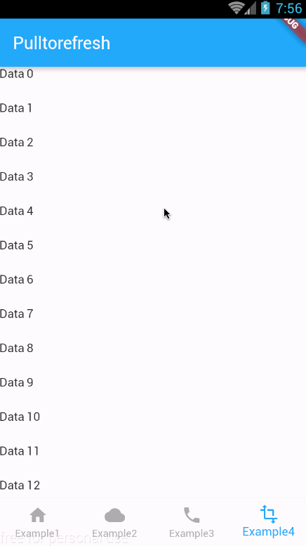
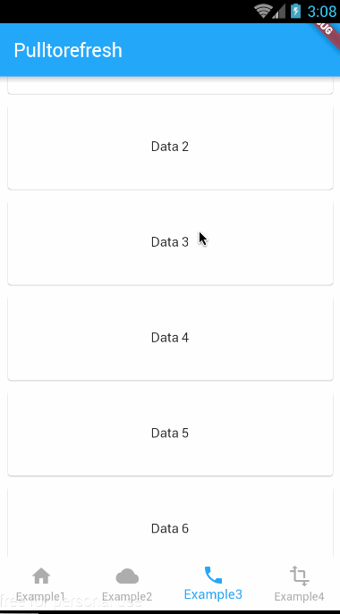

# flutter_pulltorefresh

## 介绍
一个提供上拉加载和下拉刷新的组件,同时支持Android和Ios


## 特性
* 同时支持Android,IOS
* 提供上拉加载和下拉刷新
* 几乎适合所有的部件,例如GridView,ListView,Container,Text...
* 高度扩展性和很低的限制性
* 灵活的回弹能力

## 截图
IOS:<br>
<br>
Android:<br>
<br>
IOS:<br>
<br>
Android:<br>
<br>
IOS:<br>
<br>
Android:<br>
<br>

## 我该怎么用?
1.第一步,在你的pubspec.yml声明

```

   dependencies:
     pull_to_refresh: ^1.0.7
     
```

2.然后,导入,SmartRefresher是一个组件包装在你的外部,child就是你的内容控件

```


   import "package:pull_to_refresh/pull_to_refresh.dart";
   ....
   
   build() =>
   
    new SmartRefresher(
        enablePullDownRefresh: true,
        enablePullUpLoad: true, 
        refreshMode: this.refreshing,
        loadMode: this.loading,
        onModeChange: _onModeChange,
        onOffsetChange: _onOffsetCallback,
        child: new Container(
          color: Colors.white,
          child: new ListView.builder(
            physics: const NeverScrollableScrollPhysics(),
            shrinkWrap: true,
            itemExtent: 40.0,
            itemCount: data.length,
            itemBuilder: (context,index){
              return data[index];
            },

          ),
        )
    )

```

3.你应该要根据不同的刷新模式状态下,显示不同的布局.这里有6种刷新模式状态:idle, startDrag, canRefresh, refreshing, complete,failed.buildFooter这个构造器也是同样的道理。如果你需要默认的指示器,但是需求不太一样时,比如字体颜色,图标不太相同时,你可以从直接[这里](https://github.com/peng8350/flutter_pulltorefresh/blob/master/lib/src/build_factory.dart)复制一份

```


  Widget _buildHeader(context,mode){
  // 你可以展示不同的东西通过传入的状态
     /*
     例如这样
     return new Text(
                     mode == RefreshMode.canRefresh
                         ? 'LoadMore when release'
                         : mode == RefreshMode.completed
                             ? 'Load Completed'
                             : mode == RefreshMode.failed
                                 ? 'Load Failed'
                                 : mode == RefreshMode.refreshing
                                     ? 'Loading....'
                                     : 'pull up load',
                     style: new TextStyle(color: const Color(0xff555555)));

     */
     /* this return a Gif like Example3(See my [Demo](https://github.com/peng8350/flutter_pulltorefresh/blob/master/example/lib/ui/Example3.dart))*/
    return new Image.asset("images/animate.gif",height: 100.0,fit: BoxFit.cover,);
  }
  
 
  Widget _buildFooter(context,mode){
  
    ....
  }


  new SmartRefresher(
     ....
     footerBuilder: _buildFooter,
     headerBuilder: _buildHeader
  )


```

4.
刷新状态需要你自己在逻辑代码通过setState来改变.刷新模式的细节请看下面

```

  void _onModeChange(isUp,mode){
    if(isUp){
    	//when pull down refresh
      //must be do it
      setState(() {
        refreshing = mode;
      });
      	 // this is equals onRefresh() mostly
      if(mode==RefreshMode.refreshing) {
       //Simulating a network request to capture data
        new Future.delayed(const Duration(milliseconds: 2000), () {
          setState(() {
            /*
             when you catch data failed you can. set failed, 
             else completed
             */	
            refreshing = RefreshMode.failed;
          });
          print("Refreshed!!!");
        });
      }
    }
    else{
      //must be do it
      setState(() {
        loading= mode;
      });
      // this is equals onLoaadmore()
      if(mode==RefreshMode.refreshing) {

        new Future<Null>.delayed(const Duration(milliseconds: 2000), 	() {

          setState(() {
             data.add(new Text('Data '));

            loading = RefreshMode.completed;
          });
          print("LoadComplete!!!");
        });
      }
    }
  }
  
```

5.如果你的内容控件是一个滚动的部件, 例如 ScrollView, ListView, GridView 和 so on, 你应该给这类控件分配两个属性.因为我内部封装是通过ListView来封装的,
这非常重要,如果你不注意这个,你会遇到某些问题.

```
new ListView(){
    physics: const NeverScrollableScrollPhysics(),
    shrinkWrap: true,
    child:...
}

```

## 属性表

| Attribute Name     |     Attribute Explain     | Parameter Type | Default Value  | requirement |
|---------|--------------------------|:-----:|:-----:|:-----:|
| child      | 你的内容部件   | Widget   |   null |  必要
| headerBuilder | 头部指示器构造,如果为空的话,默认传入我提供默认的头指示器     | (BuildContext,RefreshMode) => Widget  | null | 可选 |
| footerBuilder | 尾部指示器构造,i如果为空的话,默认传入我提供默认的尾指示器     | (BuildContext,RefreshMode) => Widget  | null | 可选 |
| enablePullDownRefresh | 是否允许下拉刷新     | boolean | true | 可选 |
| enablePullUpLoad |   是否允许上拉加载 | boolean | false | 可选 |
| refreshMode | 它代表头部指示器的刷新状态   | RefreshMode(enum) | RefreshMode.idle |  果你允许下拉刷新前提下是必要的，否则就是可选 |
| loadMode | 它代表尾部指示器的刷新状态   | RefreshMode(enum) | RefreshMode.idle | 如果你允许上拉加载前提下是必要的，否则就是可选 |
| completeDuration | 它代表刷新成功或失败时显示的持续时间    | int | 800 | 可选 |
| onModeChange | 当刷新模式或加载模式准备更改时，它会回调，它要求您自己更改值，第一个参数是从是否是顶部拖动，第二个是刷新模式更改过后的状态。   | (bool,RefreshMode) => Void | null | 可选 |
| onOffsetChange | 它将在拖动时回调（除了刷新状态和完成状态,范围在:0~实际距离/triggerDistance   | (double) => Void | null | 可选 |
| triggerDistance | 他的值表示要触发刷新种的状态模式要达到的拖动距离。  | double | 100.0 | 可选 |
| topVisibleRange | 当指示器进入刷新状态时显示的范围   | double | 50.0 | 可选 |
| bottomVisibleRange | 当指示器进入刷新状态时显示的范围  | double | 50.0 | 可选 |


## 注意点
1.组件是无界的，所以当你使用它时，要小心由高度引起的问题，特别是Column、Stack，这也是对无限制高度的控制，要格外小心。
 
## 开源协议
 
 ```
 
MIT License

Copyright (c) 2018 Jpeng

Permission is hereby granted, free of charge, to any person obtaining a copy
of this software and associated documentation files (the "Software"), to deal
in the Software without restriction, including without limitation the rights
to use, copy, modify, merge, publish, distribute, sublicense, and/or sell
copies of the Software, and to permit persons to whom the Software is
furnished to do so, subject to the following conditions:

The above copyright notice and this permission notice shall be included in all
copies or substantial portions of the Software.

THE SOFTWARE IS PROVIDED "AS IS", WITHOUT WARRANTY OF ANY KIND, EXPRESS OR
IMPLIED, INCLUDING BUT NOT LIMITED TO THE WARRANTIES OF MERCHANTABILITY,
FITNESS FOR A PARTICULAR PURPOSE AND NONINFRINGEMENT. IN NO EVENT SHALL THE
AUTHORS OR COPYRIGHT HOLDERS BE LIABLE FOR ANY CLAIM, DAMAGES OR OTHER
LIABILITY, WHETHER IN AN ACTION OF CONTRACT, TORT OR OTHERWISE, ARISING FROM,
OUT OF OR IN CONNECTION WITH THE SOFTWARE OR THE USE OR OTHER DEALINGS IN THE
SOFTWARE.

 
 ```